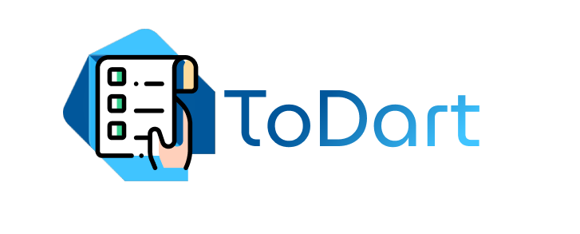

  

<h3 align="center">
    A powerful task control api in Dart.
</h3>

  

  

  

### ✌ Hello!

This project is intended for the development of a Rest API using Dart on the backend, which is normally used only on the frontend. 

You can use this project to have as a basis how to build an api using this stack.

Any problem, question or suggestion, open it as an issue and I will reply as soon as I have time. 😅

### :memo: License

MIT License. See the file [LICENSE](LICENSE.md) for more details.

Made with 💻 by Iury :wave: [See my linkedin!](https://www.linkedin.com/in/iury-ferreira-68ba35130/)
